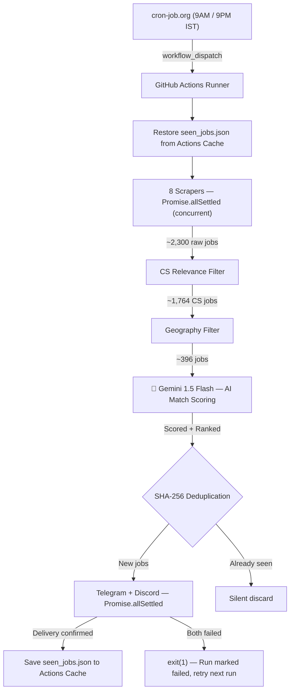

# Job Alert Bot — AI-Powered CS Job Hunter

> Automatically scrapes **8 major job platforms** twice daily, evaluates every listing against your resume using **Gemini 1.5 Flash**, and delivers AI-scored alerts directly to **Telegram** and **Discord** — serverless, database-free, hosted 100% free on GitHub Actions.

---

## Live Demo / Alert Previews

| Telegram Alert Channel | Discord Alert Channel |
|---|---|
|  |  |

---

## Features

| Feature | Details |
|---|---|
| **8 Scrapers** | Internshala, SerpAPI (Google Jobs + Naukri targets), RemoteOK, WeWorkRemotely, YCombinator, GitHub Repos, Freshersworld, Remotive |
| **🧠 AI Match Scoring** | Gemini 1.5 Flash evaluates every filtered job against your resume — scores 0–100%, explains the match, and generates a ready-to-send LinkedIn cold pitch |
| **Dual Notifications** | Multi-channel broadcasting via Telegram (rich messages) and Discord (rich embeds) concurrently |
| **Smart Filtering** | Scope-restricted classification (ALLOW/BLOCK keywords matched on titles only; experience parsing on full text) |
| **SHA-256 Deduplication** | URL normalization strips tracking params before hashing — 0% duplicate alert rate |
| **Actions Cache DB** | State persisted via GitHub Actions Cache — **zero repository commit clutter** (saves 730+ commits/year) |
| **Precise Scheduler** | Triggered via `cron-job.org` + GitHub Repository Dispatch API for **exact-second execution** |
| **Fail-Safe Delivery** | Jobs only marked "seen" if at least one notification channel confirms delivery |

---

## Schedule

| Run | Time (IST) | SerpAPI? | AI Scoring? | Sources |
|---|---|---|---|---|
| **Morning Scrape** | **9:00 AM** | ✅ Yes (8 queries) | ✅ Yes (Gemini) | All 8 scrapers |
| **Evening Scrape** | **9:00 PM** | ❌ No | ❌ No (API limit conservation) | 7 free scrapers |

---

## What an AI-Scored Alert Looks Like

```
🧪 Software Engineer Intern
━━━━━━━━━━━━━━━━━━━
🏢 Groww
📍 Bangalore 🇮🇳 India
🏷 Internship • 🔍 Google Jobs
📊 Match: 92%
💡 Strong match — requires Node.js and backend systems, aligns with your stack.
✉️ Hi, I noticed Groww is hiring a Backend Intern. Given my experience building
   Node.js data pipelines at scale, I'd love to connect about this opportunity.

🔗 Apply Now →
```

> The cold pitch (✉️) is only shown for jobs scoring **≥ 80%**. All jobs are sorted highest match first.

---

## Setup (5 minutes)

### Step 1 — Fork/Clone this repository

### Step 2 — Configure GitHub Secrets
Go to your fork's **Settings → Secrets and variables → Actions → New repository secret** and add:

| Secret Name | Where to get it | Required? |
|---|---|---|
| `TELEGRAM_BOT_TOKEN` | Message `@BotFather` on Telegram to create a bot | ✅ Yes |
| `TELEGRAM_CHAT_ID` | Message your bot, then check `https://api.telegram.org/bot<TOKEN>/getUpdates` | ✅ Yes |
| `SERPAPI_KEY` | Sign up at [serpapi.com](https://serpapi.com) (250 free searches/month) | ✅ Yes |
| `DISCORD_WEBHOOK_URL` | Discord Server Settings → Integrations → Webhooks → Create Webhook | ✅ Yes |
| `GEMINI_API_KEY` | Get a free key at [aistudio.google.com](https://aistudio.google.com) | ⭐ For AI scoring |

### Step 3 — Customize Your Profile
Edit [`data/resume_profile.json`](data/resume_profile.json) with your own skills and target roles — the AI evaluates every job against this:

```json
{
  "name": "Your Name",
  "education": "B.Tech CS, Your College (2023–2027)",
  "coreStack": ["Node.js", "Python", "React", "MongoDB"],
  "targetRoles": ["Backend Engineer Intern", "SDE Intern"],
  "targetLocations": ["India", "Remote"]
}
```

### Step 4 — Run the Seed Workflow Once
1. Go to the **Actions** tab of your repository.
2. Select **🌱 Seed Run (First-Time Setup — Run Once)**.
3. Click **Run workflow** to catalogue all current listings. Seeds the deduplication database and sends **zero notifications**.

### Step 5 — Set Up Time-Precise Scheduling
GitHub Actions built-in schedules can be delayed by hours. Use `cron-job.org` for exact-second execution:
1. Generate a GitHub PAT with `workflow` scope at [github.com/settings/tokens](https://github.com/settings/tokens).
2. Create a free account on [cron-job.org](https://cron-job.org).
3. Create two daily POST jobs targeting your GitHub workflow dispatch endpoint:
   `https://api.github.com/repos/YOUR_USERNAME/Job_Alert/actions/workflows/scrape-morning.yml/dispatches`
4. Set `Authorization: Bearer <YOUR_PAT>` and `Content-Type: application/json` headers with body `{"ref":"main"}`.


---

## Local Development & Testing

```bash
# Clone the repository
git clone https://github.com/YOUR_USERNAME/Job_Alert.git
cd Job_Alert

# Install dependencies
npm install

# Setup environment variables
cp .env.example .env
# Fill in your tokens/keys in .env

# Dry-run: scrapes and prints to console, sends no messages, LLM off
npm test

# Dry-run with AI scoring enabled (requires GEMINI_API_KEY in .env)
cross-env USE_LLM=true DRY_RUN=true node src/main.js

# Full run with notifications
npm start
```

---

## Project Directory Structure

```text
Job_Alert/
├── .github/workflows/
│   ├── scrape-morning.yml    # Morning run — SerpAPI + LLM enabled
│   ├── scrape-evening.yml    # Evening run — free scrapers only, LLM off
│   └── scrape-seed.yml       # One-time database seed workflow
├── src/
│   ├── scrapers/             # One scraper module per job platform
│   ├── core/
│   │   ├── database.js       # SHA-256 deduplication + Actions Cache persistence
│   │   ├── filter.js         # CS relevance filter (ALLOW/BLOCK keyword engine)
│   │   ├── geoFilter.js      # Geography filter (India / Remote / Tier-1 Global)
│   │   ├── llmEvaluator.js   # 🧠 Gemini 1.5 Flash AI match scoring engine
│   │   └── formatter.js      # Telegram MarkdownV2 + Discord embed formatter
│   ├── notifiers/            # Telegram and Discord delivery connectors
│   └── main.js               # Pipeline orchestrator
├── data/
│   ├── resume_profile.json   # 🧠 Your candidate profile (edit this)
│   └── seen_jobs.json        # Local test database (git-ignored)
├── Images/                   # Embedded screenshots
├── .env.example
└── package.json
```

---

## System Architecture



---

## Scraper & Geographic Rules

* **India** (all cities, Remote, WFH) → Always included
* **Global Remote** → Always included
* **Global On-Site** → Included only for Tier-1 companies (Google, Microsoft, Meta, Goldman Sachs, etc.)
* **Job expiry:** Entries purged from the dedup database after **45 days**
* **SerpAPI budget:** Exactly **240 credits/month** consumed — safely under the 250 free limit
* **Telegram rate limit:** 1.5s between messages, automatic `retry_after` handling on HTTP 429

---

## Key Design Decisions

| Decision | Choice | Why |
|---|---|---|
| **Scheduling** | External webhook (`cron-job.org`) | GitHub native cron delays 2–3 hours; API dispatch is exact-second |
| **Database** | GitHub Actions Cache (JSON) | Zero cost, zero ops — no PostgreSQL/Redis needed for a twice-daily batch |
| **Concurrency** | `Promise.allSettled` | One failed scraper/notifier doesn't kill the entire run |
| **Deduplication** | SHA-256 on normalized URL | Strips tracking params; O(1) key lookup; 0% duplicate rate |
| **Delivery gate** | Transactional rollback | Jobs only marked "seen" after confirmed delivery — no silent data loss |
| **AI evaluation** | After geo filter, before dedup | Only ~30–50 jobs hit the LLM per run — well within Gemini free tier |
