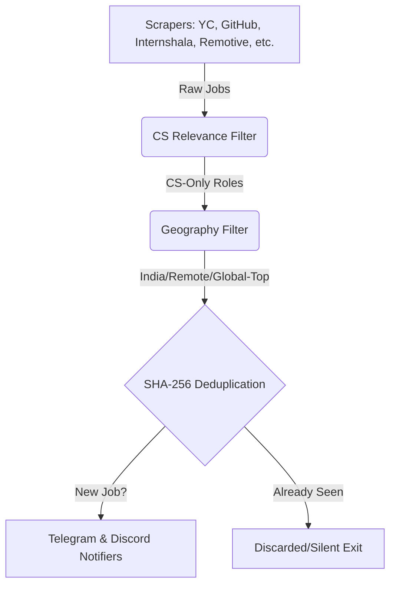

# 🤖 Job Alert Bot — CS Job Hunter

> Automatically scrapes **8 major job platforms** twice daily and delivers fresh computer science job & internship alerts directly to **Telegram** and **Discord**. Built on a serverless, database-free architecture hosted 100% free on GitHub Actions.

---

## 📸 Screenshots

| 💬 Telegram Alert Channel | 🎮 Discord Alert Channel | ⚙️ Precision Scheduler |
|---|---|---|
|  |  |  |

---

## ⚙️ System Architecture



---

## ✨ Features

| Feature | Details |
|---|---|
| **8 Scrapers** | Internshala, SerpAPI (Google Jobs + Naukri targets), RemoteOK, WeWorkRemotely, YCombinator, GitHub Repos, Freshersworld, Remotive |
| **Dual Notifications** | Multi-channel broadcasting via Telegram (rich messages) and Discord (rich embeds) concurrently |
| **Smart Filtering** | Scope-restricted classification (ALLOW/BLOCK keywords matching on titles; experience parsing on full text) |
| **Data Integrity** | SHA-256 indexing with URL query-parameter & tracking-token normalization to eliminate duplication |
| **Actions Cache DB** | State persisted natively via GitHub Actions Cache — **zero repository commit clutter** (saving 730+ commits/year) |
| **Optimal Scheduler** | Integrated with `cron-job.org` via GitHub Repository Dispatch API for **100% time-precise** execution |
| **Fail-Safe Rollback** | Dynamic transaction management; jobs are only marked "seen" if alert delivery succeeds |

---

## ⏰ Schedule

| Run | Time (IST) | SerpAPI? | Sources Scraped |
|---|---|---|---|
| 🌅 **Morning Scrape** | **9:00 AM** | Yes (8 custom queries) | All 8 scrapers |
| 🌙 **Evening Scrape** | **9:00 PM** | No | 7 free scrapers |

---

## 🛠️ Setup (5 minutes)

### Step 1 — Fork/Clone this repository

### Step 2 — Configure GitHub Secrets
Go to your fork's **Settings → Secrets and variables → Actions → New repository secret** and add:

| Secret Name | Where to get it |
|---|---|
| `TELEGRAM_BOT_TOKEN` | Message `@BotFather` on Telegram to create a bot |
| `TELEGRAM_CHAT_ID` | Message your bot, then check `https://api.telegram.org/bot<TOKEN>/getUpdates` |
| `SERPAPI_KEY` | Sign up at [serpapi.com](https://serpapi.com) (250 free searches/month) |
| `DISCORD_WEBHOOK_URL` | Discord Server Settings → Integrations → Webhooks → Create Webhook |

### Step 3 — Run the Seed Workflow Once
1. Go to the **Actions** tab of your repository.
2. Select **🌱 Seed Run (First-Time Setup — Run Once)**.
3. Click **Run workflow** to catalogue all current listings. This seeds the deduplication database and sends **zero notifications**.

### Step 4 — Set Up Time-Precise Scheduling
Because GitHub Actions built-in schedules can be delayed by hours, we trigger the bot at exact minutes via `cron-job.org`:
1. Generate a GitHub Personal Access Token (PAT) with `workflow` scope at [github.com/settings/tokens](https://github.com/settings/tokens).
2. Create a free account on [cron-job.org](https://cron-job.org).
3. Set up two daily POST requests targeting your GitHub workflow dispatch endpoint:
   `https://api.github.com/repos/YOUR_USERNAME/Job_Alert/actions/workflows/scrape-morning.yml/dispatches`
4. Add authorization and content headers along with `{"ref":"main"}` in the request body (refer to the project documentation for step-by-step header configuration).

---

## 💻 Local Development & Testing

```bash
# Clone the repository
git clone https://github.com/YOUR_USERNAME/Job_Alert.git
cd Job_Alert

# Install dependencies
npm install

# Setup environment variables
cp .env.example .env
# Fill in your tokens/keys in .env

# Run in dry-run mode (scrapes and prints to console; sends no messages)
npm test

# Run full scraping cycle locally (sends notifications)
npm start
```

---

## 📁 Project Directory Structure

```text
Job_Alert/
├── .github/workflows/
│   ├── scrape-morning.yml    # Morning Run workflow (triggered externally)
│   ├── scrape-evening.yml    # Evening Run workflow (triggered externally)
│   └── scrape-seed.yml       # One-time database seed workflow
├── src/
│   ├── scrapers/             # Scrapers for each job board
│   ├── core/                 # Database, relevance filter, and formatting engine
│   ├── notifiers/            # Telegram and Discord notification connectors
│   └── main.js               # Main execution orchestrator
├── data/
│   └── seen_jobs.json        # Local test database (git-ignored)
├── Images/                   # Embedded screenshots
├── .env.example
└── package.json
```

---

## 📋 Scraper Matching & Geographic Rules

* **India** (all cities, Remote, and Work From Home) $\rightarrow$ Always included.
* **Global Remote** $\rightarrow$ Always included.
* **Global On-Site** $\rightarrow$ Only included if the employer is a Tier-1 tech company (e.g., Google, Microsoft, Meta, Amazon).
* **Old Jobs Purge:** Scraped jobs are automatically expired from the database cache after 45 days to keep it lightweight.
* **Rate Limits:** The bot consumes exactly **240 SerpAPI search credits/month**, safely under the 250 free limit.
